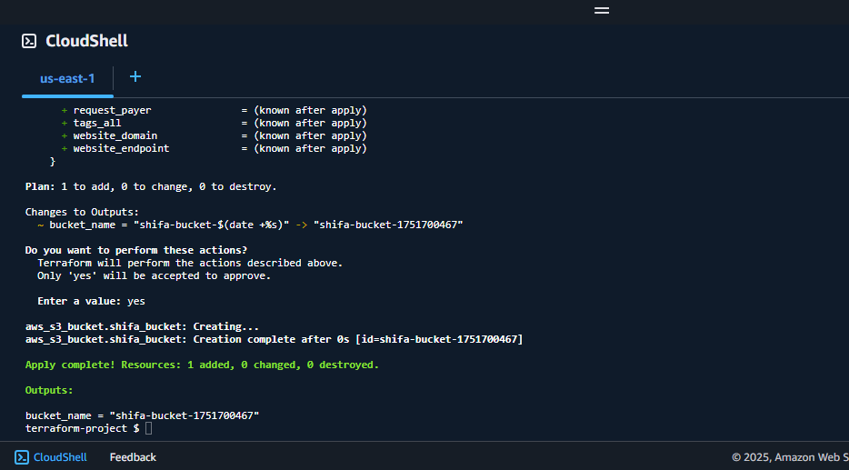
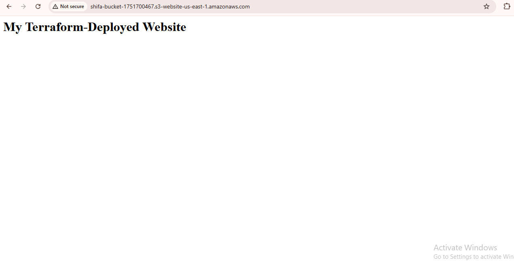
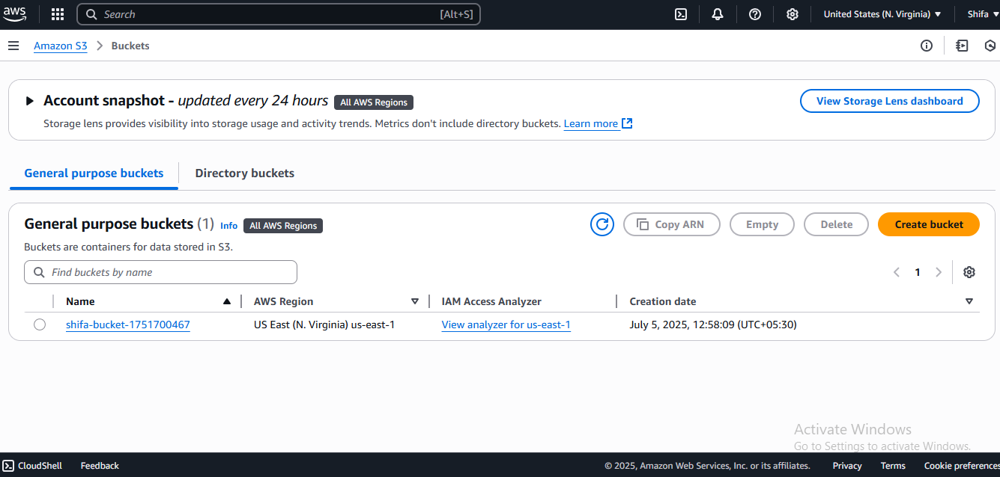
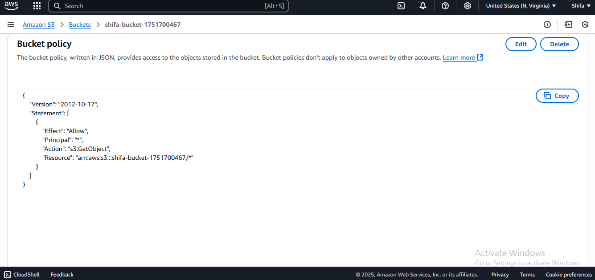

# AWS S3 Static Website with Terraform

A serverless static website deployed using Infrastructure-as-Code (IaC).  
**Key Features**:  
✅ S3 bucket with static website hosting  
✅ Secure public access via bucket policy  
✅ Terraform automation  

## Screenshot Proof  
| Terraform Deployment | Live Website |  
|----------------------|--------------|  
|  |  |  

| AWS S3 Console | Bucket Policy |  
|----------------|---------------|  
|  |  |  

## Files  
- [`main.tf`](main.tf): Terraform configuration  
- [`index.html`](index.html): Minimal website code  

## How to Replicate  
```bash
terraform init  
terraform apply  # Destroys with `terraform destroy`  
